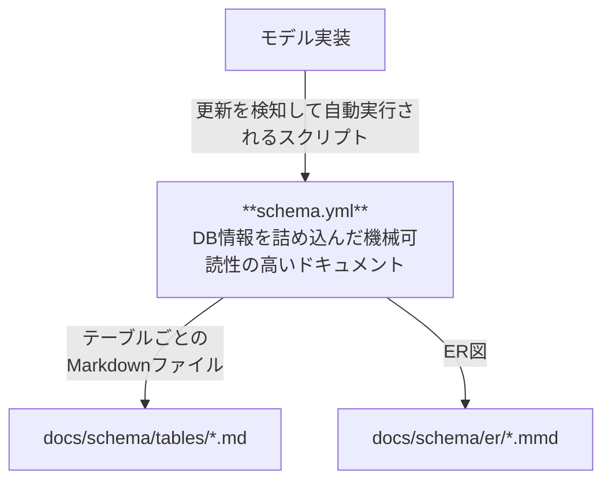

# データベース設計ドキュメントの構成

## 1. 位置付け
本ドキュメントは内部設計書群のうち **データベース設計** に関するガイドラインをまとめたものです。
モデル実装と設計ドキュメント（`schema.yml`や各テーブルの`md`ファイル）との同期を維持するためのルールを定義します。

## 2. モデル定義更新からのドキュメント自動生成フロー


## 3. スキーマ管理の原則
- **Single Source of Truth** （唯一正解となるソース）はアプリケーションの **モデル実装** である（フレームワーク利用を前提としている）
- `schema.yml` はモデルから自動生成する **AI向けの機械可読ドキュメント** である。
- 両者の差分はCIやGit hooksで検出し、ドキュメント生成スクリプトで同期する想定である。

## 4. `schema.yml` の構成
| キー   | 説明 |
|--------|------|
| `tables` | 最上位にテーブル一覧を配置 |
| `columns` | テーブル配下でカラム定義を行う |
| `indexes` | テーブル配下でインデックス定義を行う *(任意)* |
| `relations` | ER 図生成用のリレーション定義 *(任意)* |

### 4.1 カラム属性
| キー名             | 説明                 | 型例         |
|--------------------|----------------------|--------------|
| type               | データ型             | string       |
| length             | 桁数                 | int          |
| pk                 | PK（主キー）         | bool         |
| notNull            | 必須                 | bool         |
| unique             | UNIQUE 制約          | bool         |
| default            | 初期値               | any          |
| autoIncrement      | オートインクリメント | bool         |
| encrypted          | 暗号化対象           | bool         |
| comment            | カラム説明           | string       |

### 4.2 インデックス定義
```yaml
indexes:
  - columns: [user_id, status]  # カラム順に注意
    unique: false              # true にするとユニークインデックス
    name: idx_user_status      # 省略時は自動命名
```

### 4.3 リレーション定義
```yaml
relations:
  - table: account
    type: one_to_one
    fields: [user_id]
```

### 4.4 リレーションタイプの例

- `one_to_one` : 1対1リレーション（例：ユーザーとプロフィール）
- `one_to_many` : 1対多リレーション（例：顧客と注文）
- `many_to_one` : 多対1リレーション（例：注文と顧客）
- `many_to_many` : 多対多リレーション（例：生徒とクラス）

`type` キーには上記のいずれかを指定してください。

## 5. 運用ルール
- **モデル／スキーマ変更** にあたっては必ずブランチを切り PR でレビューする。
- CI で `yamllint` と派生物差分チェックを実施。

## 6. サンプル
```yaml
tables:
  account:
    comment: アカウント基本情報を保持
    columns:
      id:
        type: bigint
        pk: true
        autoIncrement: true
        comment: アカウントID
      email:
        type: varchar(254)
        notNull: true
        unique: true
        comment: ログインID
    indexes:
      - columns: [email]
        unique: true
        name: idx_account_email
```

## 7. 参考リンク
- [`docs/design-docs-best-practices.md`](./design-docs-best-practices.md) — 内部設計書全体のガイドライン 